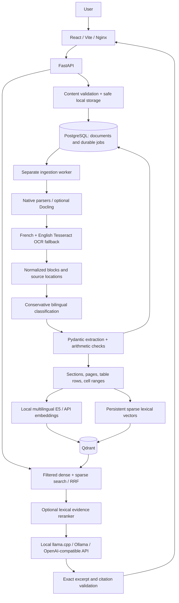

# FinScope.AI

A local financial document workspace built on the existing FastAPI and React/Vite
application. Upload multiple documents, inspect classifications and extracted
fields, and ask questions with verifiable source locations.

## Start locally

Requirements: Docker Engine with Compose v2.24+ and enough space for service images
and local models. CPU execution is supported; no API key is required.

```bash
docker compose up --build -d
docker compose logs -f prepare worker llm
```

First startup downloads the multilingual embedding model and a small local language
model. Wait for `/api/ready` to return HTTP 200. Subsequent runs reuse model caches.

* Frontend: <http://localhost:8081>
* Swagger/OpenAPI: <http://localhost:8001/docs>
* Readiness: <http://localhost:8001/api/ready>
* Qdrant dashboard: <http://localhost:6333/dashboard>

Upload using the drop zone or file picker. The request returns immediately after
validation/storage; the document list updates while the worker processes each job.
Click a filename to inspect extracted fields, provenance, tables, and processing
errors. Check document boxes and/or choose a document type to restrict chat.
Citations open the original file or its extraction details. The existing financial
calculator remains available below the document list.

```bash
docker compose stop
docker compose start
```

Uploads, PostgreSQL metadata, Qdrant vectors, and model caches use persistent named
volumes. `docker compose down` keeps them; `docker compose down -v` deletes them.
Existing `data/uploads` and `data/chroma_db` files are preserved. Re-upload existing
documents through the API to import them into the new metadata and vector stores.

## Architecture



The previous PDF parser and calculator are retained. Native pdfplumber geometry
and tables underpin the new PDF ingestion. The previous Chroma/BM25 implementation
kept its sparse index only in memory and did not fuse rankings; Qdrant now persists
both named dense and sparse vectors, payload metadata, and text.

The database is also the durable queue, avoiding a second Redis dependency.
Workers atomically claim jobs. Each ingestion runs in a child process with a hard
timeout. Pending jobs survive restarts; abandoned processing jobs are recovered
after `INGESTION_TIMEOUT + 60` seconds. Documents being processed cannot be deleted
until the job completes or fails. Reindexing is idempotent and returns an existing
active job when one is already queued.

## Formats and locations

| Input | Parsing and citation location |
| --- | --- |
| PDF | Page text, geometric tables; OCR when machine text is insufficient; actual page number |
| PNG, JPG/JPEG, WebP, TIFF/TIF | Tesseract OCR, confidence and bounding boxes; filename, TIFF frame when applicable |
| DOCX | Paragraphs, headings, ordered tables; section, without invented page numbers |
| XLSX | Sheets, table rows, original cell coordinates, formulas and cached values |
| XLS | Native `xlrd` reader, sheets and cell coordinates; macros never execute |
| CSV | Delimiter detection, rows and column ranges |
| TXT, Markdown | Lines, headings, paragraphs, Markdown tables |
| PPTX | Text and tables with slide numbers |
| HTML | Text/headings/tables; scripts/styles removed; original downloads as attachment |

Legacy `.doc` and `.ppt` are not accepted; export to DOCX/PPTX or PDF first. The
minimum legacy spreadsheet requirement is supported directly through `xlrd`, so
LibreOffice is not needed. Password-protected documents and macro/ActiveX OOXML
containers are rejected. XLSX formulas are preserved but never executed; a missing
cached result remains unavailable rather than being calculated or fabricated.

Native parsing is the default to preserve the working PDF code and precise Excel
coordinates without mandatory layout-model downloads. Optional Docling conversion
for PDF/DOCX/PPTX/HTML is available by installing
`backend/requirements-docling.txt` and setting `PARSER_PROVIDER=docling`. The default
Docker image and baseline tests use the native parsers. Docling reports OCR enabled;
per-block OCR provenance depends on the converter's output.

## Classification and extraction

Classes are `invoice`, `devis`, `bilan`, and `other`. Rules consider bilingual titles,
references, accounting vocabulary, commercial fields, and table presence. Filenames
are not classification evidence. Scores below `CLASSIFICATION_THRESHOLD`, or
conflicting high scores, produce `other`. The stored result includes confidence,
reason, and signals. Confidence is a rule score, not a calibrated probability.

Pydantic schemas expose invoice/quote references, parties, dates, currency, line
items, totals, payment terms, and balance-sheet/income-statement fields. Missing
values are null. Each extracted value carries its document, block, excerpt, and
available page/table/sheet/cell/section provenance. Financial tables retain all rows
and columns, including comparative periods. Scalar financial-statement fields
select the first recognized value; consult the full table for multiple periods.
Arithmetic checks flag subtotal-plus-tax and quantity-times-unit-price mismatches
without replacing source values.

## Retrieval and answers

Multilingual E5 small runs locally as a quantized Hugging Face ONNX model through
FastEmbed. Query/document prefixes are applied. The lexical index uses normalized
bilingual financial terms, stable token hashes, term-frequency weights, and
Qdrant's IDF modifier. Qdrant performs Reciprocal Rank Fusion of dense and sparse
candidate lists. An optional transparent reranker emphasizes lexical agreement
and exact financial identifiers. Embedding model fingerprints prevent accidentally
mixing different models in one collection.

Only completed documents are searchable. Explicit document/type filters are
intersected; recognizable invoice/quote/report wording also narrows the search.
Exact references restrict evidence to matching documents. Comparison queries seek
evidence across documents instead of returning several chunks from just one file.

The default language model is Qwen2.5 0.5B through a CPU llama.cpp server. It selects
short, relevant evidence excerpts in a structured response. The application checks
every excerpt against the actual supplied chunk, checks citation IDs and metric
labels, and renders only verified text with source links. This deliberately limits
unconstrained financial prose. Missing/invalid evidence produces an explicit
insufficient-information response. It does not claim that a citation alone proves
every interpretation of a complex financial statement.

Uploaded content is untrusted data in the system prompt. Models have no tools or
access to application secrets. Detected embedded instructions cannot become answer
excerpts. Provider failures return useful HTTP 503 errors. `LLM_PROVIDER=extractive`
selects a documented no-LLM mode; it is never presented as an LLM response.

The starter model is small. Complex reconciliation, determining whether a quote
became an invoice, and exhaustive comparisons beyond the context budget may need
a stronger configured model and explicit references. The synthetic evaluation is
a regression benchmark, not a measure of arbitrary real-world financial accuracy.

## Configuration

Copy `.env.example` to `.env` to customize settings. It lists every application
variable and comments for provider selection. Compose sets internal database,
storage, and Qdrant addresses; host-run settings use localhost. Set API credentials
only in your local environment. Existing `backend/.env` is supported; process
environment variables take precedence.

| Settings | Purpose |
| --- | --- |
| `MAX_FILE_SIZE`, `MAX_FILES_PER_UPLOAD` | Per-file bytes and upload count |
| `MAX_DOCUMENT_PAGES`, `MAX_SPREADSHEET_CELLS`, `MAX_IMAGE_PIXELS`, `MAX_ARCHIVE_BYTES` | Parser resource limits |
| `DUPLICATE_BEHAVIOR` | `reuse` (default), `reject`, or `allow`, based on SHA-256 |
| `CLASSIFICATION_THRESHOLD` | Minimum financial-class rule score |
| `OCR_LANGUAGES`, `OCR_TIMEOUT`, `OCR_MIN_TEXT_CHARS` | OCR languages, per-image timeout, PDF fallback threshold |
| `INGESTION_TIMEOUT`, `WORKER_POLL_INTERVAL` | Hard job timeout and queue polling |
| `CHUNK_WORDS`, `TABLE_CHUNK_ROWS` | Paragraph and table chunk limits |
| `EMBEDDING_PROVIDER`, `EMBEDDING_MODEL`, `EMBEDDING_DIMENSIONS` | Local/API embedding setup |
| `EMBEDDING_BASE_URL`, `EMBEDDING_API_KEY`, `EMBEDDING_LOCAL_ONLY` | API endpoint or cached offline execution |
| `LLM_PROVIDER`, `LLM_MODEL`, `LLM_BASE_URL`, `LLM_API_KEY` | Local, Ollama, OpenAI-compatible, or extractive answers |
| `RETRIEVAL_TOP_K`, `RERANK_TOP_K`, `MIN_RETRIEVAL_SCORE`, `RERANK_ENABLED` | Retrieval candidate/context budgets and score threshold |
| `RETRIEVAL_DEBUG` | Expose retrieved chunks only in development and when request `debug=true` |

Changing the embedding model/dimension requires a new `QDRANT_COLLECTION` and
reindexing. Dense vectors are stored only in Qdrant, not PostgreSQL.

To use Ollama, set `LLM_PROVIDER=ollama`, `LLM_BASE_URL=http://ollama:11434`,
`LLM_MODEL=qwen2.5:1.5b`, then run:

```bash
docker compose --profile ollama up --build -d
```

To use an API provider, set `LLM_PROVIDER=openai`, its model, a base URL ending in
`/v1`, and `LLM_API_KEY`. API embeddings use their separate `EMBEDDING_*` settings.
Local operation does not send document text to an external API. Configuring an
external provider sends the corresponding chunks/questions to that provider.

## API examples

```bash
curl -F 'files=@facture.pdf' -F 'files=@devis.xlsx' \
  -F 'files=@bilan.pdf' -F 'files=@invoice_photo.jpg' -F 'files=@notes.txt' \
  http://localhost:8001/api/documents/upload

curl http://localhost:8001/api/documents
curl http://localhost:8001/api/documents/DOCUMENT_UUID/status
curl http://localhost:8001/api/jobs/JOB_UUID
curl http://localhost:8001/api/documents/DOCUMENT_UUID/extraction

curl -H 'Content-Type: application/json' \
  -d '{"question":"Quel est le montant total de la facture ?","document_ids":[],"document_types":["invoice"]}' \
  http://localhost:8001/api/chat/query

curl -X POST http://localhost:8001/api/documents/DOCUMENT_UUID/reindex
curl -X DELETE http://localhost:8001/api/documents/DOCUMENT_UUID
```

Uploads return HTTP 202 with `documents` containing document/job IDs plus independent
per-file `errors`. A fully rejected batch returns an appropriate 4xx/503. A duplicate
in `reuse` mode returns the original document and its latest job. List endpoints
support pagination; document details include normalized blocks. The old singular
`file` upload field and chat `query` alias remain accepted.

## Tests and evaluation

The backend image includes development/test dependencies:

```bash
docker compose exec backend python -m scripts.generate_test_documents
docker compose exec backend pytest
docker compose exec backend python -m scripts.evaluate_rag
docker compose exec backend python -m scripts.evaluate_rag --llm
docker compose exec backend ruff check backend/app backend/migrations scripts tests
```

`scripts/generate_test_documents.py` produces five invoices, five quotes, five
financial statements, five other documents, and additional edge fixtures in
`tests/fixtures/documents`, with `ground_truth.json`. All data is fictional.
Evaluation reports classification accuracy, retrieval hit@1/@3/@5, citation
accuracy, extraction accuracy, and answer coverage. It uses temporary SQLite and
Qdrant stores and never modifies application uploads/indexes. Default evaluation
uses actual OCR/embeddings/retrieval and deterministic excerpt selection, independent
of LLM wording; `--llm` additionally exercises the configured live model.

The live definition-of-done script uploads the requested five-format batch and
asserts types, fields, tables, answers, source pages/cells, and absent-answer behavior:

```bash
docker compose exec backend python -m scripts.check_workflow --base-url http://localhost:8000 --receipt /app/data/workflow.json
docker compose restart backend worker postgres qdrant
docker compose exec backend python -m scripts.check_workflow --base-url http://localhost:8000 --receipt /app/data/workflow.json --restart-check
```

After a restart, wait for the services to become healthy before running the check.
Executed results are recorded in [docs/verification.md](docs/verification.md).

## Run backend/frontend outside Docker

Install Python 3.12+, Node 20.19+, libmagic, and Tesseract with English/French data.
On Ubuntu: `sudo apt-get install libmagic1 tesseract-ocr tesseract-ocr-eng tesseract-ocr-fra`.
From the repository root:

```bash
python3 -m venv .venv
.venv/bin/pip install -r backend/requirements-dev.txt
docker compose up -d qdrant llm
export PYTHONPATH=backend:.
.venv/bin/alembic upgrade head
.venv/bin/python -m scripts.prepare_models
.venv/bin/uvicorn app.main:app --host 127.0.0.1 --port 8001
# Separate terminal, from repository root:
PYTHONPATH=backend:. .venv/bin/python -m app.worker
# Frontend terminal:
cd frontend
npm ci
npm run dev
```

Run `.venv/bin/pytest` from the root, or `pytest` with the environment activated.
The Vite development server proxies `/api` to port 8001. Run `npm run lint` and
`npm run build` in `frontend` for frontend checks.

## Troubleshooting

* **Startup still pending:** inspect `docker compose logs prepare llm migrate`.
  Model/image downloads require internet on first use. Download caches persist.
* **OCR failed:** inspect the job error, verify `tesseract --list-langs`, and use a
  clearer/larger image. Blank or tiny images fail explicitly rather than indexing
  empty content. Adjust OCR/job timeouts for large scans.
* **Job pending:** check worker health and database connectivity. A terminated job
  is recovered after the bounded lease interval, not immediately on every restart.
* **Unknown total:** inspect source text, table headers and extraction warnings.
  Extraction is conservative and leaves unfamiliar/missing values null.
* **Embedding model changed:** use a fresh collection and reindex documents.
* **Provider 503:** verify URL/model, model download completion, API credentials
  when applicable, and timeout. Switch explicitly to extractive mode if desired.
* **Port conflicts:** change `BACKEND_PORT`, `FRONTEND_PORT`, `QDRANT_PORT`, or
  `LLM_PORT`; update Vite proxy/CORS for a changed host development API port.
* **External deployment:** this is a local, single-workspace application. Published
  service ports bind to loopback; authentication and per-user tenancy are not included.

Implementation references: [Qdrant hybrid queries](https://qdrant.tech/documentation/search/hybrid-queries/),
[Docling supported formats](https://docling-project.github.io/docling/usage/supported_formats/),
[OpenAI Chat Completions](https://developers.openai.com/api/reference/python/resources/chat/subresources/completions/methods/create),
[llama.cpp Docker documentation](https://github.com/ggml-org/llama.cpp/blob/master/docs/docker.md).
